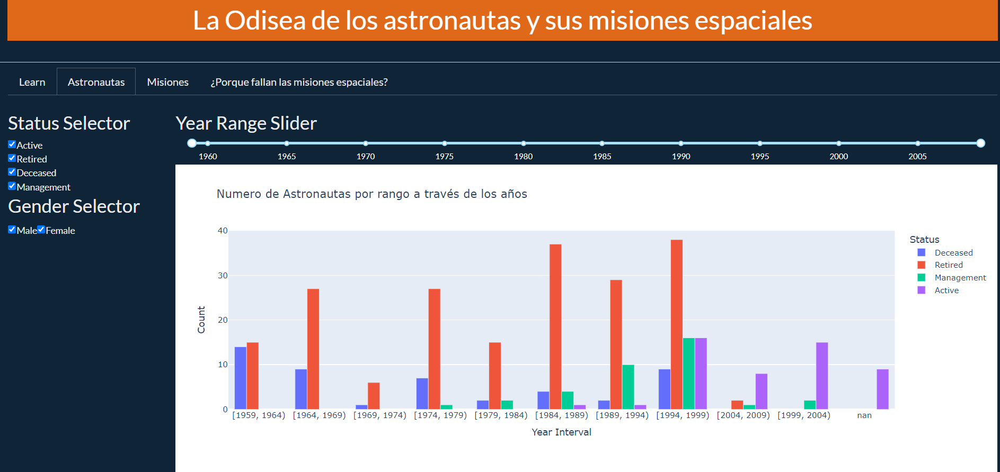
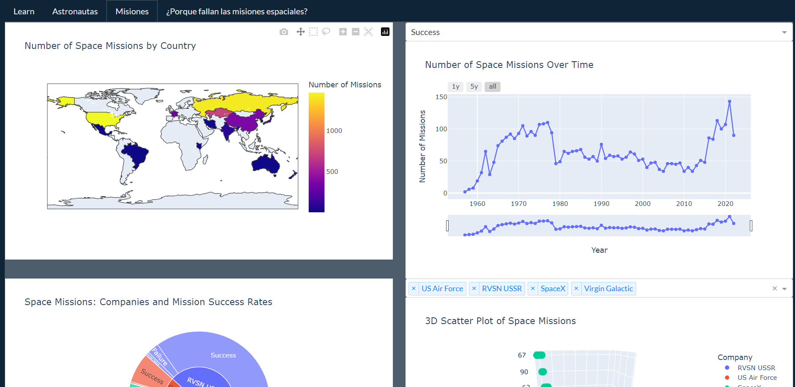
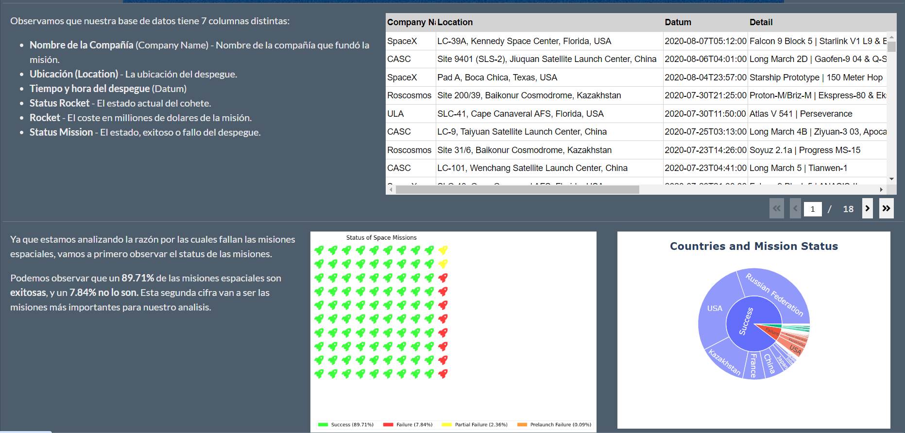

# Dash App analysing the Space Race since the 1950's

## Project Presentation: 
Download the PDF to get a quick preview into the data analysis from the Space race since 1950: 


## Project Description
This data visualization application is designed to analyze and present detailed information about space exploration. It is divided into three main sections:

### Tab 1: Analysis of American Astronauts

Detailed analysis of U.S. astronauts, including their backgrounds, education, career progression, and mission frequency.

### Tab 2: Exploratory Analysis of Space Missions (Since 1950)

Explores data on space missions since 1950, including mission frequency, missions by country, cost comparisons, and mission success by company.

### Tab 3: Study of Factors Contributing to Mission Success

A deeper analysis of the factors influencing the success of space missions, such as country of origin, day of the month, or company.

## Installation Requirements
To install the necessary libraries:

```
pip install -r requirements.txt
```
## To run the application, open the folder in your IDE of choice and execute:

```
python app.py
```

Hope you like it!
